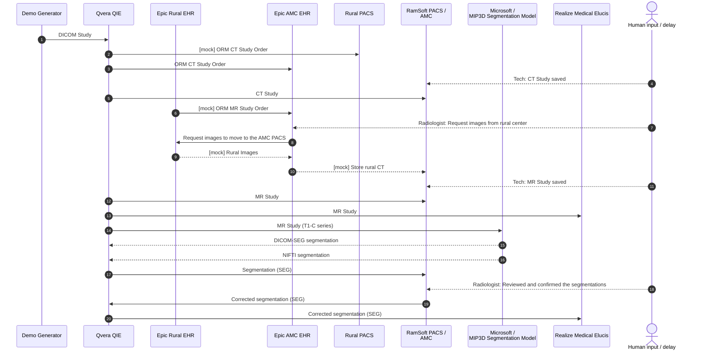

# Team Stoney Flow Chart

```mermaid
sequenceDiagram
    participant Generator as Demo Generator
    participant Qvera as Qvera QIE
    participant Epic-R as Epic Rural EHR
    participant Epic-AMC as Epic AMC EHR
    participant PACS-R as Rural PACS
    participant RamSoft as RamSoft PACS /<br/> AMC
    participant Microsoft as Microsoft /<br> MIP3D Segmentation Model
    participant Elucis as Realize Medical Elucis
    actor Human as Human input / delay
    
    autonumber

    Generator ->> Qvera: DICOM Study
    Qvera ->> PACS-R: [mock] ORM CT Study Order 
    Qvera ->> Epic-AMC: ORM CT Study Order
    Human -->> RamSoft: Tech: CT Study saved
    Qvera ->> RamSoft: CT Study
    Epic-R ->> Epic-AMC: [mock] ORM MR Study Order 
%%  CT results come back, patient is referred to AMC
%%  Rural center orders imaging at AMC 
    Human -->> Epic-AMC: Radiologist: Request images from rural center 
    Epic-AMC ->> Epic-R: Request images to move to the AMC PACS
    Epic-R -->> Epic-AMC: [mock] Rural Images
    Epic-AMC -->> RamSoft: [mock] Store rural CT
%%  Wait until MR images come back from the image center    
    Human -->> RamSoft: Tech: MR Study saved
    Qvera ->> RamSoft: MR Study
    Qvera ->> Elucis: MR Study
    Qvera ->> Microsoft: MR Study (T1-C series)
    Microsoft -->> Qvera: DICOM-SEG segmentation
    Microsoft -->> Qvera: NIFTI segmentation
    Qvera ->> RamSoft: Segmentation (SEG)
 %% Delay until Ramsoft reviews the seg
    Human -->> RamSoft: Radiologist: Reviewed and confirmed the segmentations
    RamSoft ->> Qvera: Corrected segmentation (SEG)   
    Qvera ->> Elucis: Corrected segmentation (SEG)
```
