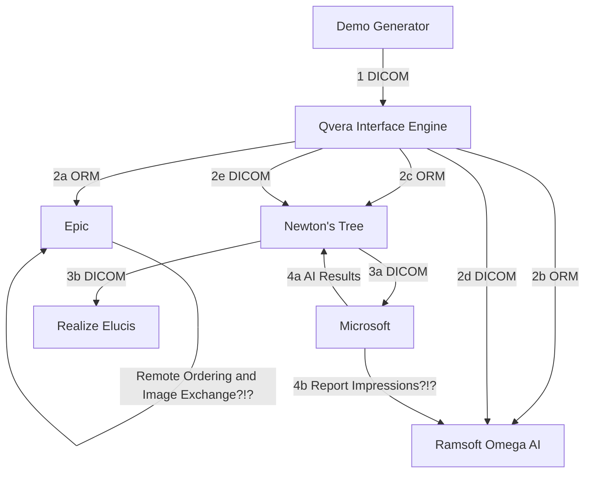

# Team Stoney Flow Chart

```mermaid
flowchart TD
    Generator[Demo Generator] --> |1 DICOM| Qvera[Qvera Interface Engine]
 
    Qvera --> |2a ORM| Epic
    Qvera --> |2b ORM| Ramsoft[Ramsoft Omega AI]
    Qvera --> |2c ORM| NT[Newton's Tree]
    Qvera --> |2d DICOM| Ramsoft
    Qvera --> |2e DICOM| NT

    NT --> |3a DICOM| Microsoft[Microsoft]
    NT --> |3b DICOM| Realize[Realize Elucis]

    Microsoft[Microsoft] --> |4a AI Results| NT
    Microsoft[Microsoft] --> |4b Report Impressions?!?| Ramsoft

    Epic --> |Remote Ordering and Image Exchange?!?| Epic
```
